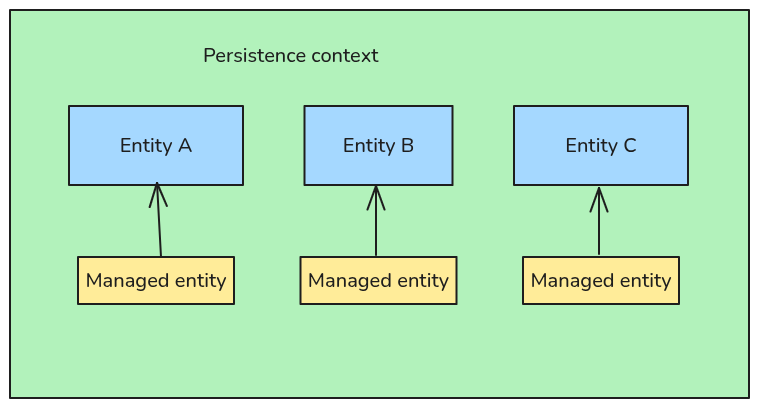

# Description
The persistence context is a runtime memory area managed by the `EntityManager` where
JPA tracks and manages entity instances.

Think of it as a container of managed entities — when an entity is in the persistence
context, it's in a Managed state, and any changes you make to it are automatically synchronized
with the database when the transaction is committed.

</img>

## How It Fits With `EntityManager`
- the `EntityManager` manages the persistence context;
- each `EntityManager` has its own persistence context;
- when the `EntityManager` is closed, the persistence context is gone, and all managed entities become detached.
