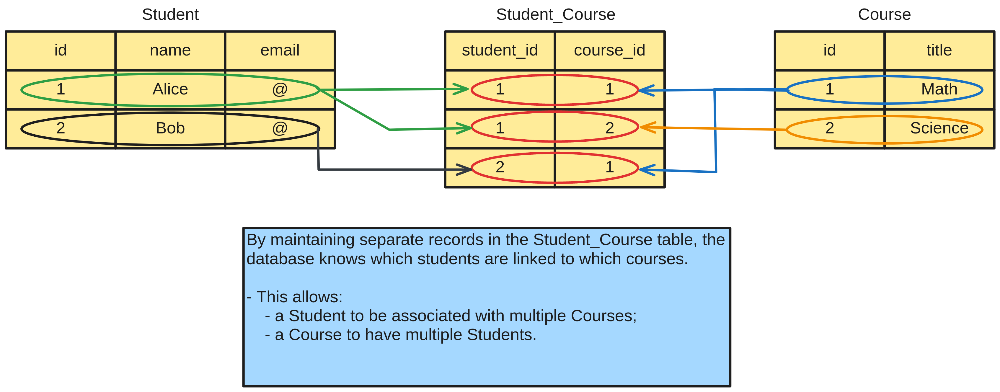

# Definition
**In Java, the `@ManyToMany` annotation has the following characteristics:**
- it is used to define a many-to-many relationship between two entities;
- this means that one instance of an entity can be associated with multiple instances of another entity, and vice versa;
- it typically involves the creation of a [junction table](../indirect/indirect.md) to manage the
associations between the two entities;
- each entity's collection in the relationship is usually defined using a `Set` or `List`;
- the `@JoinTable` annotation is often used to specify the junction table, with the `@JoinColumn`
annotation defining the foreign keys.

