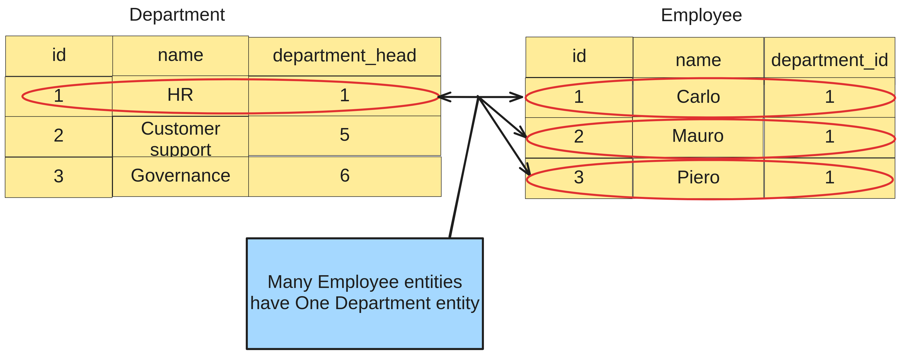

# Definition
**The `@ManyToOne` annotation has the following characteristics:**
- it is used to define a many-to-one relationship between two entities;
- this means that many instances of the source entity are associated
with a single instance of the target entity.

