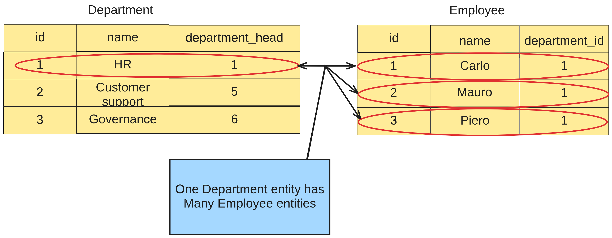

# Definition
**The `@OneToMany` annotation has the following characteristics:**
- it defines a one-to-many relationship between two entities;
- in this relationship, one entity (the "one" side) is related to multiple
instances of another entity (the "many" side);
- imagine that the **Customer support** and **Governance** departments also have a `department_head`,
that isn't being shown in the image;
- each of these departments also probably having "many" employees.

