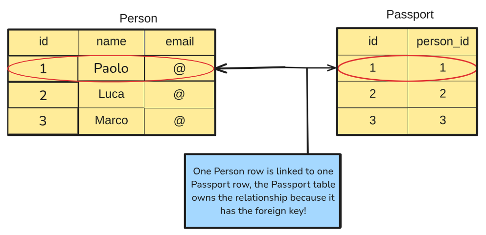

# Definition
**The `@OneToOne` annotation has the following characteristics:**
- it is used to define a one-to-one relationship between two entities;
- this means that one instance of an entity is associated with 
one and only one instance of another entity.

