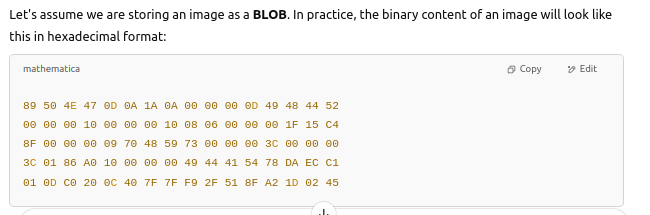
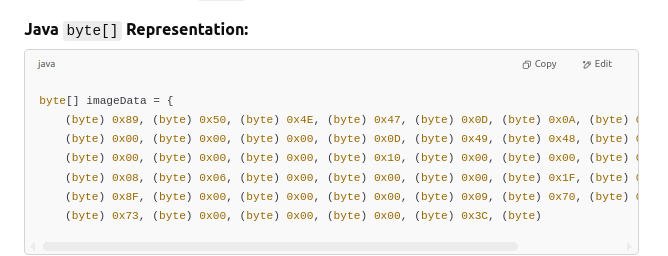

# `BLOB`
**`BLOB` (binary large object) has the following characteristics:**
- it is mapped to the `java.sql.Blob` class;
- it does not store character data;
- it is a **varying-length binary string** that can be up to 2,147,483,647 characters long;
- the length is given in bytes for `BLOB` unless one of the suffixes K, M, or G is given;
- it is used for storing binary data which includes images and sound;
- it can also be used for cryptography.
- **this data type is supported by these technologies:**
    - MySQL
    - PostgreSQL

**DDL statement:**
```
profile_picture BLOB
```
**DB Value:**

</img>

**Java mapping:**

</img>