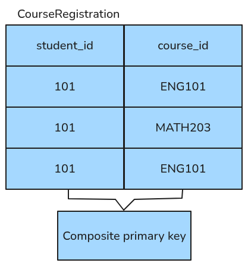

# Composite key
**A composite primary key has the following characteristics:**
- it is used when a primary
key consists of more than one attribute;
- it must be defined in a 
primary key class;
- it can be denoted using either the 
`jakarta.persistence.EmbeddedId` or `jakarta.persistence.IdClass` annotations.

**In the example image below
we can see a visual representation of a composite key:**

