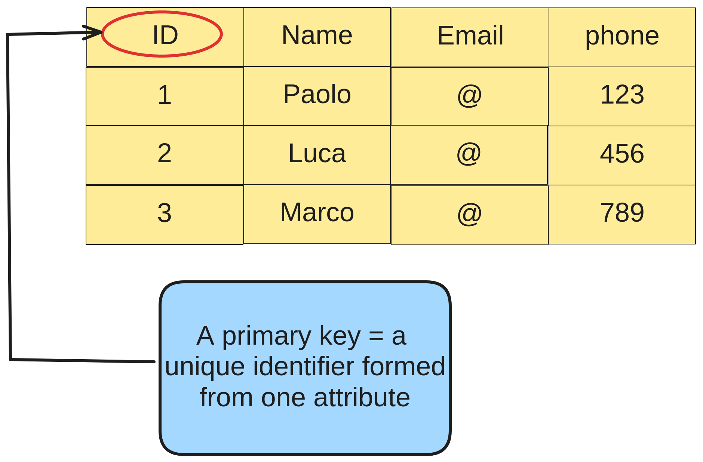

# Primary key
**A primary key has the following characteristics:**
- it is a unique object identifier for an [entity](../../../../../definition/definition.md) 
(a table); each entity has one.

**In the example image below
we can see a visual representation of a primary key:**

