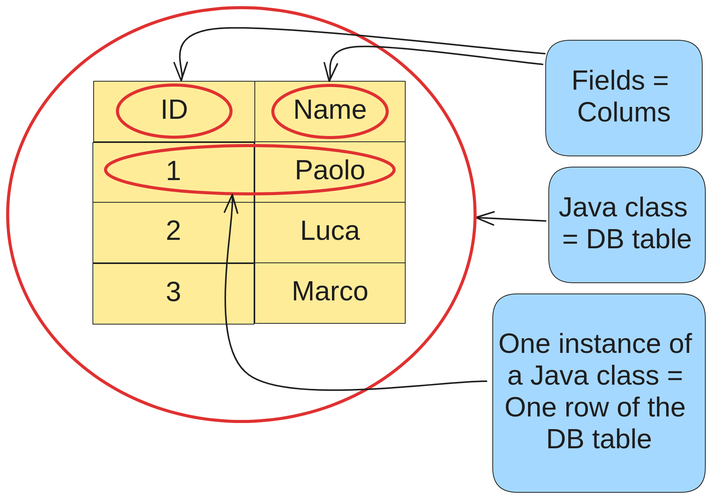

# table vs instance
**In JPA**:
- [entities](../definition/definition.md) are Java classes 
that map to database tables;
- each instance of an entity class corresponds to a row 
in the table, and the class's fields map to the
table's columns.

**In the example image below
we can see a visual representation:**

