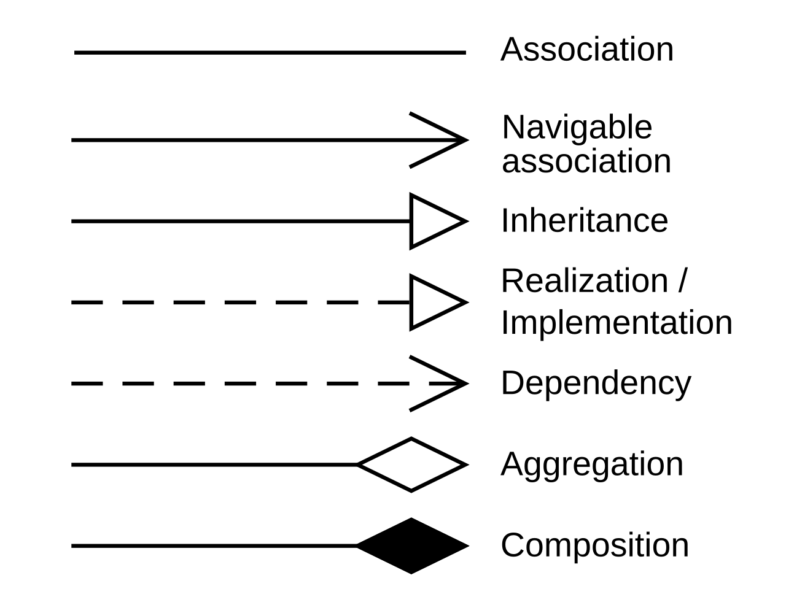

# UML Class Diagrams

<p align="center">
  
</p>


---

## 1. Association

**“These classes know about each other.”**

### Line style

* Solid line
* Optional arrow for navigability
* Multiplicity is **optional**

### Examples

**Direct association:**

```text
Customer ───────── Order
```

**Association with multiplicity:**

```text
Customer 1 ───────── 0..* Order
```

### Meaning

* Objects hold references to each other
* Relationship is structural and long-lived
* Represents a “has-a” relationship (e.g., a customer has orders)
* Multiplicity refines how many objects are related
* If multiplicity is omitted, the line represents a simple direct association

---

## 2. Aggregation

**“This class has parts, but the parts can live independently.”**

### Line style

* Solid line
* Hollow (white) diamond at the whole side

### Multiplicity

* Optional but commonly shown

### Example

```text
Team 1 ◇──────── 0..* Player
```

### Meaning

* The whole object groups part objects
* Represents a “has-a” relationship (e.g., a team has players)
* Parts can exist without the whole
* Ownership is weak
* Semantically stronger than association, but lifecycle is independent

---

## 3. Composition

**“This class owns its parts completely.”**

### Line style

* Solid line
* Filled (black) diamond at the whole side

### Multiplicity

* Optional but usually explicit

### Example

```text
House 1 ◆──────── 1..* Room
```

### Meaning

* Parts cannot exist without the whole
* Represents a “has-a” relationship (e.g., a house has rooms)
* Whole controls the lifecycle of its parts
* Strong ownership
* Destroying the whole destroys the parts

---

## 4. Inheritance (Generalization)

**“This class IS a type of that class.”**

### Line style

* Solid line
* Hollow triangle pointing to the parent class

### Multiplicity

* Not applicable

### Example

```text
Dog ─────────▷ Animal
```

### Meaning

* Child class inherits attributes and behavior
* Represents an *is-a* relationship (e.g., a dog is an animal)
* Enables polymorphism
* This is a type hierarchy, not an object relationship

---

## 5. Realization

**“This class implements that interface.”**

### Line style

* Dashed line
* Hollow triangle pointing to the interface

### Multiplicity

* Not applicable

### Example

```text
CreditCardPayment ─ ─ ─ ─▷ Payable
```

### Meaning

* Class commits to fulfilling an interface contract
* Interface defines what must be done, not how
* Represents an *implements-a* relationship (e.g., `CreditCardPayment` implements `Payable`)
* Relationship exists at the type level, not instance level

---

## 6. Dependency

**“This class temporarily uses that class.”**

### Line style

* Dashed line
* Open arrow pointing to the supplier

### Multiplicity

* Not applicable

### Example

```text
OrderProcessor ─ ─ ─ > PaymentService
```

### Meaning

* One class uses another without owning it
* Typically via method parameters, return types, or local variables
* Relationship is short-lived and weak
* Does not imply “has-a”
* Changes in the supplier may affect the dependent class

