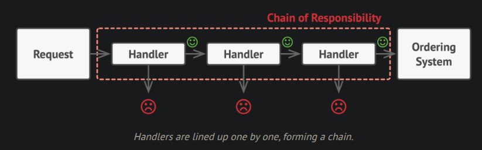

# Real Life Analogy

Imagine you’re relaxing at home, watching Netflix, when suddenly you receive a text saying **your credit card has been suspended**. Alarmed, you call your bank’s customer support line to fix the issue.

The first thing you hear is a **robotic voice assistant** asking if English is your preferred language. Once you make your choice, you’re passed to a **first-level operator** who listens to your problem, but unfortunately, they can’t help. So, they **transfer your call** to someone else who might be able to assist.

This continues until you finally reach the **right specialist** who can resolve your issue.

Here’s what’s happening behind the scenes:

* each **operator** represents a **handler** in a chain;
* each handler has a specific **responsibility**, for example, verifying identity, checking account status, or resolving technical issues;
* if an operator can handle your request, they do so;
* if not, they **pass your request along** to the next handler in the chain.

At any point, a handler can decide to **stop passing the request further**, for example, if your problem is resolved or if the issue doesn’t fit any category.

In software terms, this is exactly how the **chain of responsibility design pattern** works:

a request flows through a **chain of handlers**, and each one decides whether to **process** it or **delegate** it to the next handler.

So next time you get lost in a maze of automated phone menus and transfers, remember, you’re not just experiencing bureaucracy, you’re living through the **chain of responsibility pattern in real life**!

