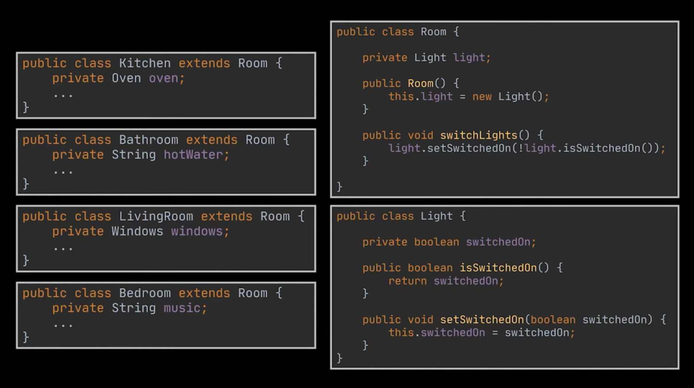
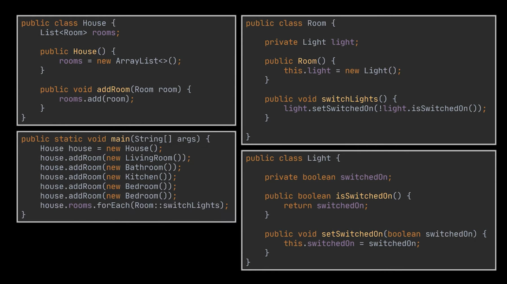
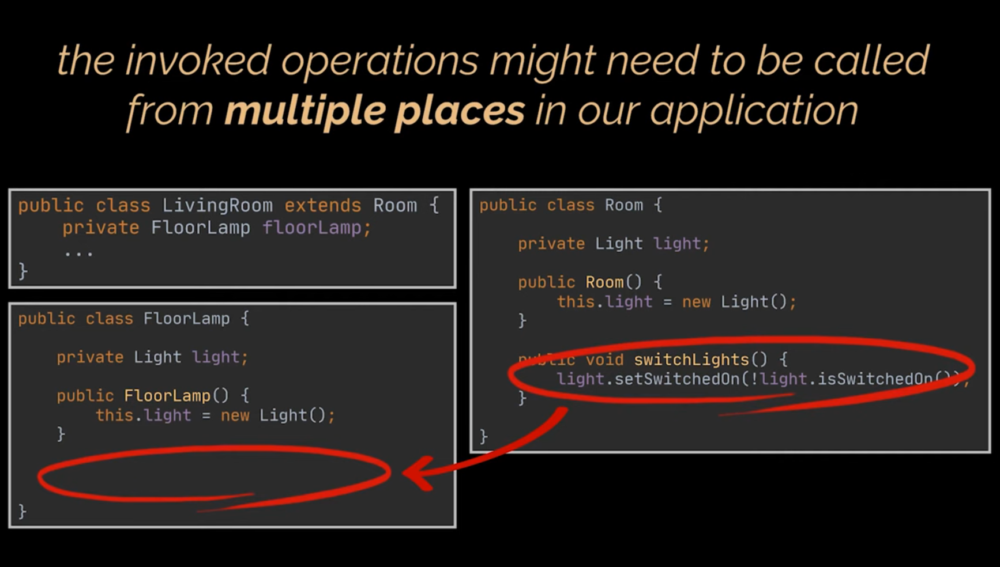
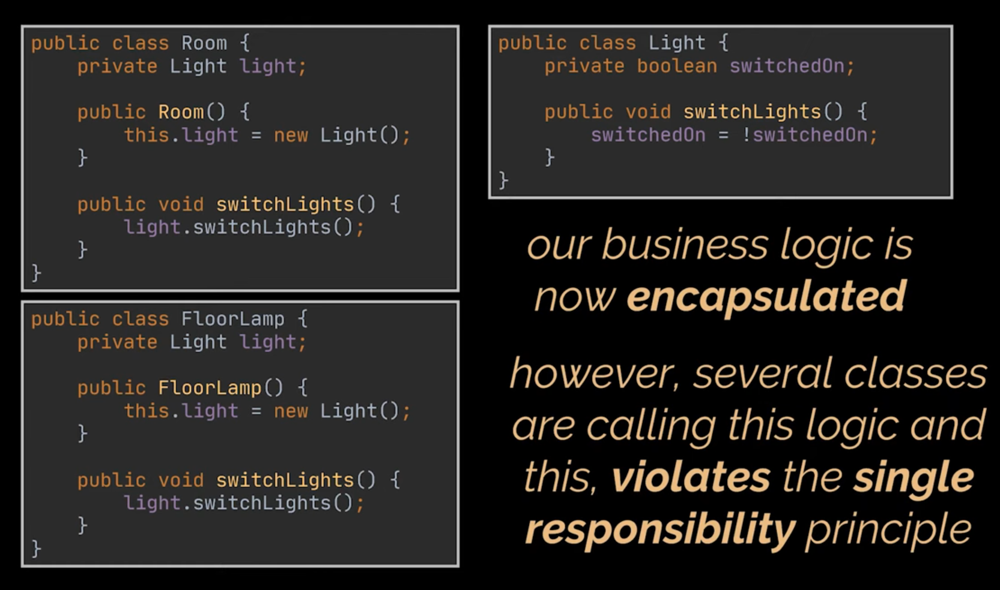

# Wrong Way

A **non-functional** way to implement the solution to the previously mentioned problem is the following.

In our current approach, several issues arise from the way the light-switching logic is implemented.

- **excessive subclassing**:

  - we have an enormous number of subclasses;
  - each time we modify the light’s logic in the base `Room` class, we risk breaking code in all of these subclasses;
  - this leads to high maintenance overhead and fragile code.

- **lack of flexibility:**

  - consider the case where the house owner installs **motion sensors** in the bathrooms;
  - the app should no longer need to control the bathroom lights manually;
  - however, with our current design, this is not possible, the `Bathroom` class extends the `Room` class, and the logic for turning lights on and off is implemented in the base class;
  - therefore, we can’t selectively disable that feature for specific rooms.

---

- **code duplication across unrelated classes**:

    - the situation becomes worse when we want to control lights that are **not part of a room**, such as a **floor lamp** in the living room;
    - we can’t make the `FloorLamp` class extend the `Room` class, because a lamp isn’t a room;
    - this forces us to **duplicate** the light-switching logic inside the `FloorLamp` class, violating the DRY (Don’t Repeat Yourself) principle.

---

- **encapsulation fix - moving logic to the `Light` class**:

  - to address this, we can move the **light-switching logic** from the `Room` and `FloorLamp` classes into the `Light` class itself;
  - by doing this, we **encapsulate** the behavior responsible for switching lights;
  - any future change to this logic will automatically propagate across all parts of the application that use the `Light` class.

- **remaining issue - responsibility overlap:**

  - although we’ve improved encapsulation, the design still has multiple classes directly calling the light-switching logic themselves;
  - this violates the **Single Responsibility Principle (SRP)**: a class should only have one reason to change;
  - in our case, both the `Room` and `FloorLamp` classes are still responsible for performing operations that should belong exclusively to the command logic.
