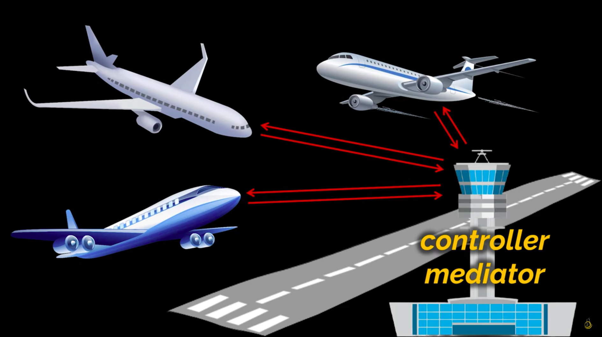

# Real Life Analogy - Analogy 1 - Airport

Imagine an airport where multiple airplanes are preparing to **land or take off**.
If every pilot had to **directly communicate** with every other pilot nearby, it would be absolute chaos each pilot would need to keep track of dozens of other planes, coordinate timing, and constantly update everyone else. It would be nearly impossible to manage safely.

Instead, **pilots don’t talk to each other directly**.
They all communicate with a **single air traffic controller**, sitting in the control tower.

This controller acts as a **mediator**:

* the controller receives information from each plane (its position, intent to land or depart);
* then, based on all that information, the controller coordinates who should land or take off and when;
* each pilot only needs to know what the controller tells them, not what all the other pilots are doing.

By introducing this **central point of communication**, pilots (the components) are **decoupled** from each other. They rely on the **control tower (mediator)** to manage all interactions and ensure smooth coordination.

If the airport changes procedures (say, new landing rules), only the **control tower’s logic** needs updating — the pilots can stay the same.

---

**In short:**

> The air traffic controller is the mediator that coordinates communication between airplanes so they don’t have to talk to each other directly — just like the Mediator Pattern coordinates communication between objects without them being tightly coupled.

---

