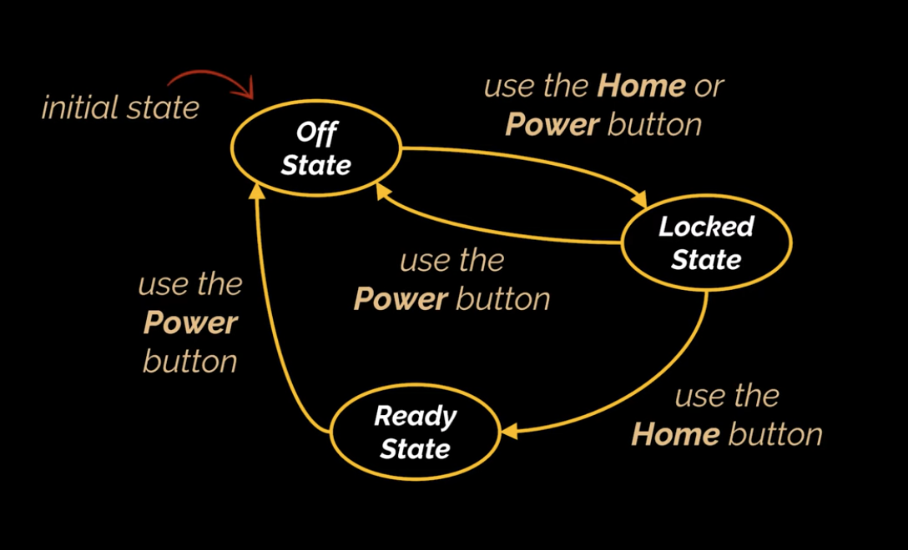

# Real Life Analogy

Imagine you’re using your smartphone. It has two main buttons: the **home** button and the **power** button.

Now, what these buttons do depends entirely on the state your phone is currently in:

- if your phone is `OFF` and you press the **power** or **home** button: it turns **on**, but the screen is locked;
- if your phone is `LOCKED` and you press the **home** button: it **unlocks** and becomes **ready to use**;
- if your phone is `LOCKED` and you press the **power** button: it turns **off** again;
- if your phone is `READY` (unlocked) and you press the **power** button: it **locks** or even turns **off**, depending on implementation.

Notice something interesting here:
the same button behaves differently depending on the state of the phone.

You, as the user, don’t need to worry about which “if-else” condition is being checked inside the phone’s code.

Each state (`OFF`, `LOCKED`, `READY`) knows what to do when a button is pressed.

When a button is clicked, the phone simply delegates the action to the current state object, which decides what should happen next, possibly even changing the phone to another state.

**In software terms:**
- the phone is the [Context](../description/description.md): it holds a reference to its current state;
- each [State](../description/description.md) ([OffState](../description/description.md), [LockedState](../description/description.md), [ReadyState](../description/description.md)) defines its own version of how to handle button presses;
- the phone changes its internal state object when a transition occurs, for example, from [OffState](../description/description.md) to [LockedState](../description/description.md);

- this setup allows the phone to change its behavior dynamically, without using long chains of conditionals and without modifying existing code when new states are added (like “do not disturb” or “airplane mode”).

**State diagram:**

