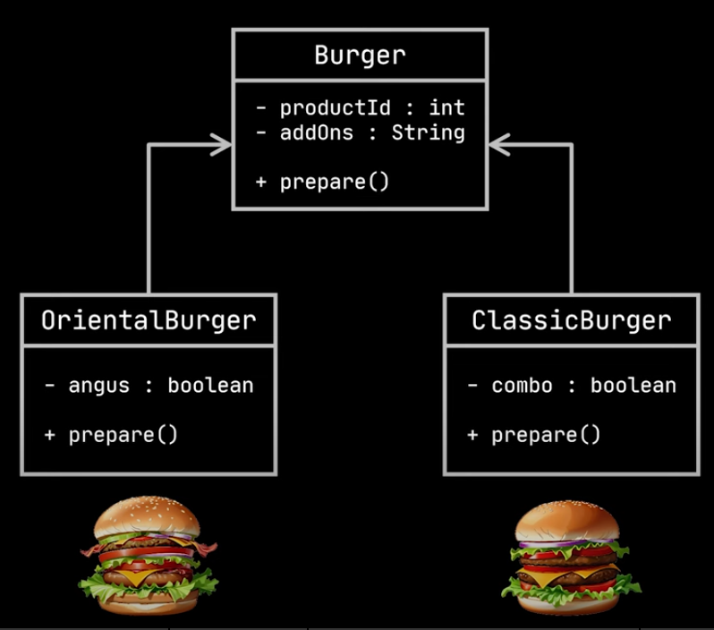

# Real Life Analogy

- a restaurant has different types of hamburger;
- we want to create a delivery app to order the hamburger;
- each hamburger is represented by the following class:

    

- we want to create a method `Burger orderBurger()` for the restaurant class;
- we want the `orderBurger()` method to respect the open-closed principle;
- it shouldn't be modified for each hamburger we add to the restaurant.
