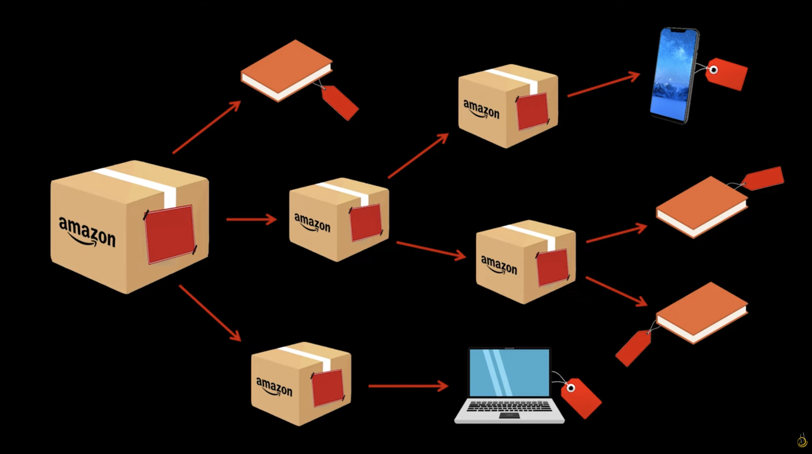

# Real Life Analogy

Imagine a large e-commerce company’s delivery system, such as Amazon.

In this system, **orders are packed into boxes**. A box can contain:

* individual products (such as books or video games), and
* other smaller boxes, which themselves may contain more products or even more boxes.

This creates a **nested structure**:
a large “mother” box → smaller boxes → even smaller boxes → products.

Now suppose the delivery system needs to **calculate the total price** of everything inside a box. That total should include:

* the price of each individual product;
* the prices of products inside all nested boxes;
* potentially an extra packaging cost added by each box.

### The Problem Without the Composite Pattern

Without a unified approach, the system would need to:

* check whether an item is a product or a box;
* if it is a box, manually open it and inspect its contents;
* repeat this process for every level of nesting.

As the system grows—new product types, new box rules, additional costs—this logic becomes increasingly complex and difficult to maintain. Every change requires revisiting and modifying existing calculation code.

### How the Composite Pattern Solves This

Using the **composite design pattern**, both **products** and **boxes** are treated as the same type of object.

* a **common interface** defines an operation such as `calculatePrice()`.
* **Products** implement this operation by simply returning their own price.
* **Boxes** implement the same operation by:

    * asking each item they contain for its price;
    * summing the results;
    * optionally adding their own packaging cost.

If a box contains another box, that box performs the same operation on its contents. The calculation naturally flows through the entire structure, no matter how deeply nested it is.

### Why This Works So Well

From the system’s point of view:

* it does not need to know whether it is dealing with a product or a box;
* it treats **individual objects and collections of objects uniformly**;
* each object is responsible for calculating its own cost.

This mirrors how shipping works in the real world:
when you ship a large box, you don’t manually calculate the price of every internal layer—you trust each package to already “know” what it contains.

### Key Insight

The composite design pattern allows complex, tree-like structures to be handled **as if they were single objects**, making the system flexible, extensible, and easy to maintain.

**Image:**

