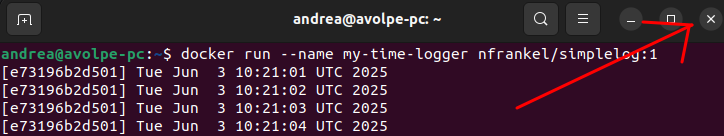
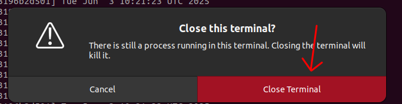

# Non-Interactive Mode

- if you run a container **without** using the interactive mode (`-it` flag) and in attached mode (**without** `-d` flag) you cannot detach from it using the combination key mentioned in the [previous chapter](../interactive/interactive.md):

    ```text
    Ctrl + P followed by Ctrl + Q
    ```

- in this case you have to close the terminal from GUI;
- **if you press `CTRL + C`, it stops the container because `ctrl + C` sends a kill signal to the main process**. 

**Example:**

1. run a container **without** using the interactive mode (`-it` flag) and in attached mode (without `-d` flag), that prints the current date time each second:

    ```commandline
    docker run --name my-time-logger nfrankel/simplelog:1
    ```

2. close the terminal by GUI:

    

3. click on "Close Terminal":

   
4. check if the container is still running:

    ```commandline
    docker ps
    ```
    
    output:
    
    ```commandline
    CONTAINER ID   IMAGE                  COMMAND                  CREATED              STATUS              PORTS                                NAMES
    e73196b2d501   nfrankel/simplelog:1   "/bin/sh -c /log.sh"     About a minute ago   Up About a minute                                        my-time-logger
    ```
