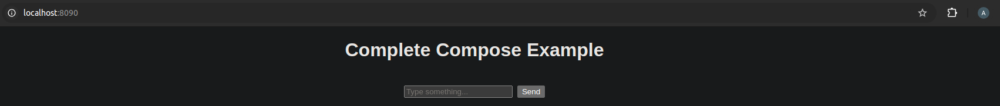
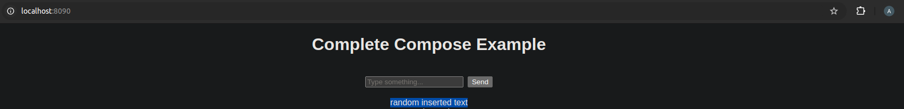

# Test the Program

If everything started correctly, you can test the program:

1. open a browser and navigate to this address: `http://localhost:8090/`;
2. you should see the frontend `index.html` page:

    

3. insert a random sentence like `random inserted text` within the input text and click on `send`;
4. after the page reloads, you should see the word appear below the input field; each time the page reloads, all previously entered words are displayed beneath the input:

    
5. [clean up the service](../clean-up/clean_up.md);
6. [run the stack](../run/run-stack/run_stack.md) again and reload the page;
7. you should still see the `random inserted text` string still under the input box, if yes it means the volume is running correctly:

    
