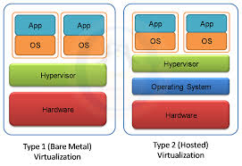

# Comparison

In this chapter, we show a comparison between [VM type 1](../type-one/type_one.md) vs [VM type 2](../type-two/type_two.md).

**Table:**

| Feature          | Type 1 Hypervisors              | Type 2 Hypervisors             |
|------------------|---------------------------------|--------------------------------|
| **Installation** | directly on hardware            | on an operating system         |
| **Performance**  | higher (direct hardware access) | lower (host OS overhead)       |
| **Use Case**     | enterprise/Production           | personal/development           |
| **Examples**     | VMware ESXi, Hyper-V            | VirtualBox, VMware Workstation |

**Image:**

