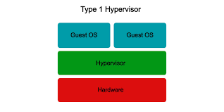

# Type 1

- installed directly on the physical hardware;
- do not require an underlying operating system;
- provide better performance and efficiency because they interact directly with hardware;

- commonly used in enterprise environments for data centers and production servers.

**Examples:**

- VMware ESXi;
- Microsoft Hyper-V;
- KVM (Kernel-based Virtual Machine);

- Xen Project;
- Oracle VM Server.

**Image:**

