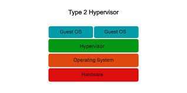

# Type 2

- Installed on top of a host operating system;
- Easier to set up but slightly less efficient because they run as applications on the host OS;
- Typically used in personal or development environments.

_Examples:_

- VMware Workstation/Fusion;
- Oracle VirtualBox;
- Parallels Desktop (macOS);

- QEMU (Quick Emulator).

**Image:**

