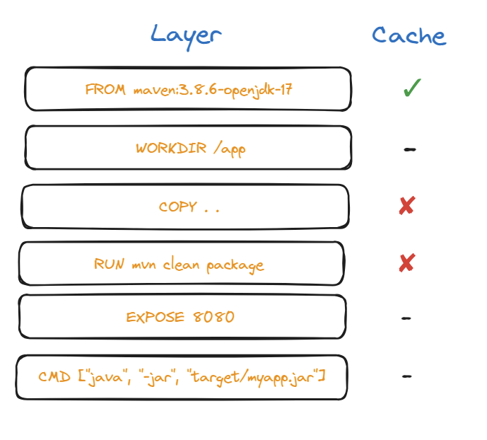

# Non-Optimized `Dockerfile`

```dockerfile
# Use Maven with JDK
FROM maven:3.8.6-openjdk-17

# Set working directory
WORKDIR /app

# Copy everything (invalidates cache when any file changes)
COPY . .

# Build application (dependencies re-downloaded every time)
RUN mvn clean package

# Expose port if needed
EXPOSE 8080

# Run the application
CMD ["java", "-jar", "target/myapp.jar"]
```

**Why is this inefficient:**
- **`COPY . .` copies everything at once**, so any change in a `.java` file invalidates the cache, forcing Maven to **re-download all dependencies**;
- **builds are slow** because every build step must be re-run, even if dependencies haven’t changed.

**Image:** 

In this image, we consider the following scenario:
- we already build the image once;
- we are building the image for the second time, just changing a line within the Java code;
- instructions with `-` don't invalidate the cache because they only add metadata to the image;


- they don't execute any commands or interact with the filesystem during the build process, so Docker doesn't consider them a cache-breaking change:

    
