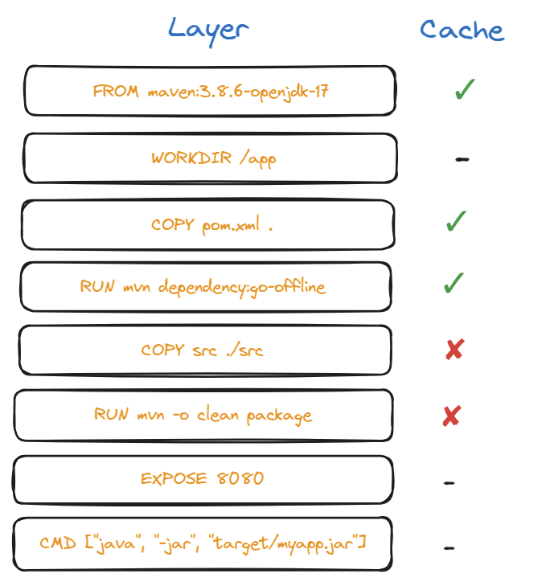

# Optimized `Dockerfile`

```dockerfile
# Use Maven with JDK
FROM maven:3.8.6-openjdk-17

# Set working directory
WORKDIR /app

# Copy only dependency-related files first (better caching)
COPY pom.xml .

RUN mvn dependency:go-offline

# Now copy the rest of the application (code changes won't affect dependency cache)
COPY src ./src

# Build application
RUN mvn -o clean package

# Expose port if needed
EXPOSE 8080

# Run the application
CMD ["java", "-jar", "target/myapp.jar"]
```

**Why is this optimized:**
- **dependencies are cached properly:**
    - `COPY pom.xml .` ensures Maven downloads dependencies **only if the `pom.xml` changes**;
    - `RUN mvn dependency:go-offline`:
      - downloads and caches all required dependencies for the project in the local Maven repository (`.m2`);
      - this ensures that when the actual build (`mvn package`) runs later, it doesn't need to re-fetch dependencies from the internet, improving Docker caching and speeding up subsequent builds;
      - without it, Maven would check and download dependencies during every build, which can slow down the process and cause failures if there's no internet connection.
    - `RUN mvn -o clean package`: 
      - runs Maven in offline mode to clean the target directory and compile the project into a packaged artifact (like a JAR or WAR) using only locally cached dependencies without accessing remote repositories.
- **application code (`src/`) is copied after dependencies:**
    - code changes **won’t trigger a full re-download** of dependencies;
    - this makes the build significantly faster.

- **reduces unnecessary re-builds**
    - if only `.java` files change, only the final `mvn package` step runs.

**Image:** 

In this image, we consider the following scenario:
- we already build the image once;
- we are building the image for the second time, just changing a line within the Java code:
- instructions with `-` don't invalidate the cache because they only add metadata to the image;


- they don't execute any commands or interact with the filesystem during the build process, so Docker doesn't consider them a cache-breaking change:

    
