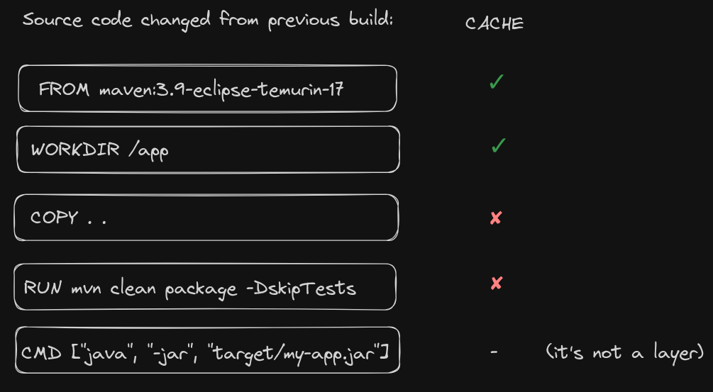

# Non-Optimized

- in this example, we show a `Dockerfile` that copies a Maven project within the image and build it;
- this is the non-optimized version, where the caching mechanism isn't optimized.

**Problem:**

- every time you update the source code, even if `pom.xml` stays the same, Maven will re-download all dependencies;
- this happens because the `COPY` instruction includes both `pom.xml` and the source code in a single step;
- so when any part of it changes, Docker invalidates the entire layer, including the cached dependencies.

**Dockerfile:**

```dockerfile
# 1. Use Maven + JDK base image
FROM maven:3.9-eclipse-temurin-17

# 2. Set working directory
WORKDIR /app

# 3. Copy everything at once (pom.xml + source code)
COPY . .

# 4. Build the project
RUN mvn clean package -DskipTests

# 5. Run the JAR
CMD ["java", "-jar", "target/my-app.jar"]
```

**Image:**


