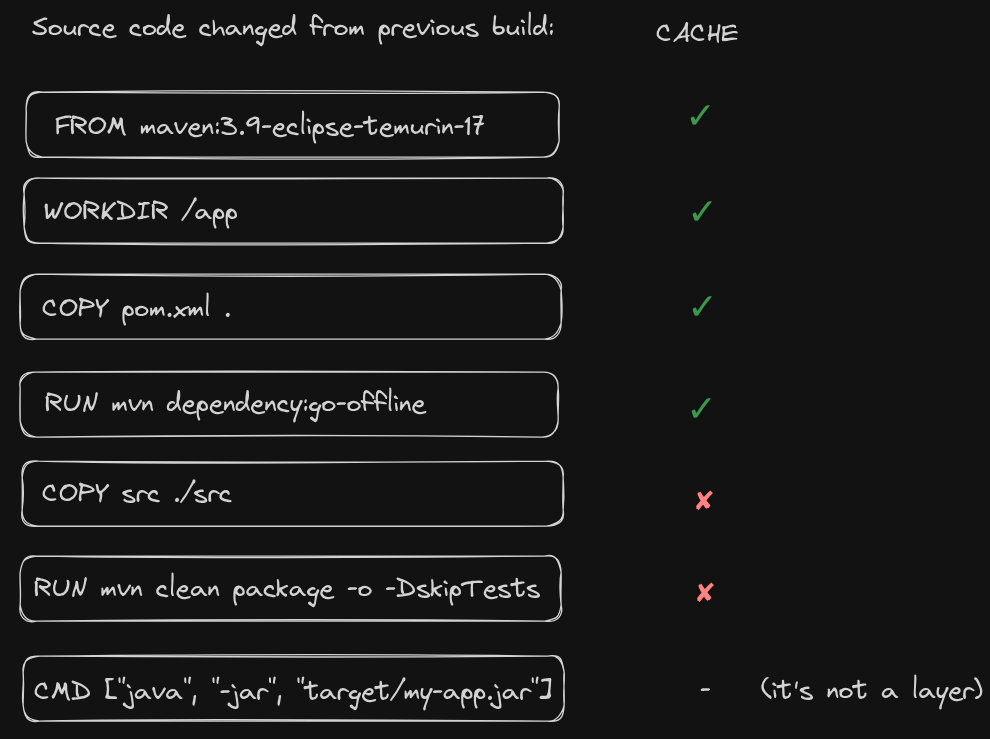

# Optimized

- in this example, we show a `Dockerfile` that copies a Maven project within the image and build it;
- this is the optimized version of the [previous](../non-optimized/non_optimized.md) example, where the caching mechanism is optimized.

**Cache improvement:**

- the `pom.xml` file is copied early in the build process, as it changes less frequently than the source code;
- Maven dependencies are then installed, allowing Maven to work offline;
- this prevents re-downloading dependencies during the `mvn clean package` step;
 

- finally, the source code is copied;
- in this way, changing the source code only invalidates this layer and those below it, not the dependency layer, which is more expensive to rebuild.

**Dockerfile:**

```dockerfile
# 1. Use Maven + JDK base image
FROM maven:3.9-eclipse-temurin-17

# 2. Set working directory
WORKDIR /app

# 3. Copy pom.xml first (rarely changes)
COPY pom.xml .

# 4. Download dependencies
RUN mvn dependency:go-offline

# 5. Copy the source code (changes frequently)
COPY src ./src

# 6. Package the app
RUN mvn clean package -o -DskipTests

# 7. Run the JAR (replace with your actual JAR file name)
CMD ["java", "-jar", "target/my-app.jar"]
```

**Image:**


