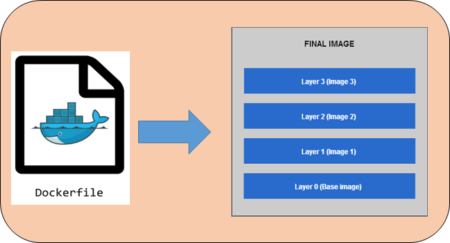

# What Is a Layer?

- a layer is a read-only filesystem change created from a single instruction in a `Dockerfile`;
- a layer is a **tar archive** of filesystem changes (additions, deletions, modifications) made by a Dockerfile instruction like `RUN`, `COPY`, or `ADD`;
- think of it as a snapshot of the image until that command.

**Image:**

