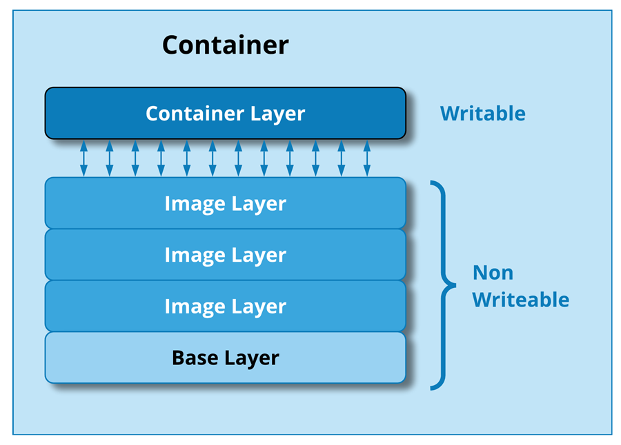

# Image Layers with Container

- when you run a container, Docker adds a **read-write layer** on top (called the container layer);
- changes made during runtime (writing logs, modifying files) happen there, and disappear when the container is deleted;
- the underlying layers remain untouched;
 

- the writable layer is discarded when the container is removed;
- to persist important data, you should store it in [volumes](../../volume/index.md).

**Image:**

