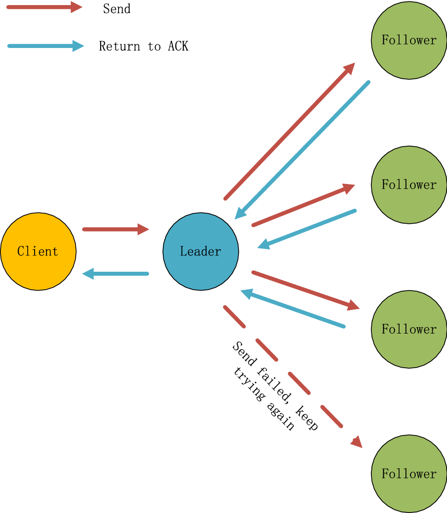

# Roles

- only manager nodes participate in the Raft consensus alghoritm;
- **among the managers, just one is the leader, and the rest are followers**;
- **leader**: responsible for managing and coordinating all state changes in the cluster by receiving client requests, replicating log entries to followers, and committing changes once a quorum is reached;

- **follower**: passively replicates the leader’s log entries, responds to leader heartbeats, and can become a candidate if the leader fails.

**Image:**

