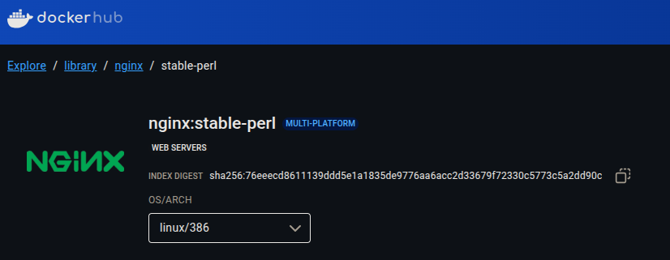

# Verify that the Image is Updated

After pushing new code to GitLab, verify that the Docker Swarm service was updated accordingly:

1. get the `index digest` of the image that your service is running:

    ```commandline
    docker service inspect nginx-stable-perl --format '{{.Spec.TaskTemplate.ContainerSpec.Image}}'
    ```
    
    output:
    
    ```commandline
    nginx:stable-perl@sha256:76eeecd8611139ddd5e1a1835de9776aa6acc2d33679f72330c5773c5a2dd90c
    ```

   - the `index digest` is a unique, immutable identifier for the multi-platform image manifest; 
   - **if the app code changes, the image layers change, which alters the manifest and thus produces a new digest**;
   - the **manifest** is a JSON document that describes the image’s configuration and layers;
   - for multi-platform images, an **index manifest** references different manifests for each platform (e.g., `linux/amd64`, `linux/arm64`);
   - the **index digest** is computed as a SHA256 hash of the index manifest JSON;
   - which is a file that **lists and references the digests of each platform-specific image manifest** (e.g., for `linux/amd64`, `linux/arm64`), so any change in a platform variant results in a new, unique digest.
2. verify that the `index digest` from your running service matches the one on Docker Hub:

    
