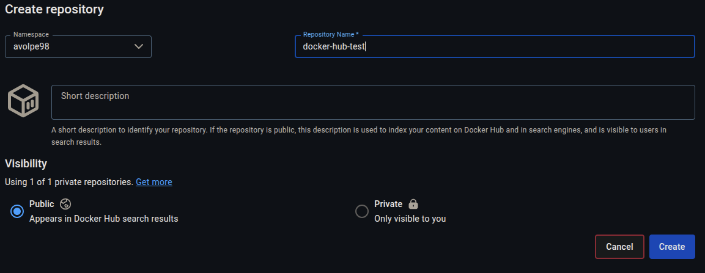

# Docker Hub Repository

1. access the [hub.docker.com](https://hub.docker.com/repositories/) repositories section, using your credentials;
2. click on "Create a repository";
3. put "docker-hub-test" as project name and select a namespace, in our case `avolpe98`:

    

    **make the repository private, we couldn't since we already have a private repo;**
4. click on "Create".