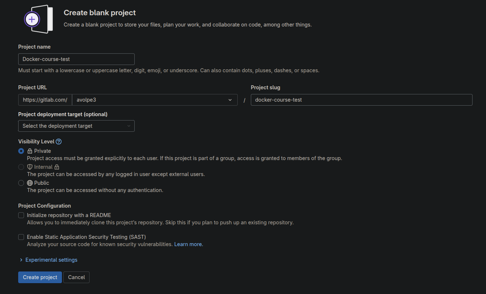

# GitLab Repository

1. access to [gitlab.com](https://gitlab.com/) using your credentials;
2. click on "New Project";
3. click on "Create blank project";
4. put "Docker-course-test" as project name and put a name for your namespace, in our case `avolpe3`:

    

    **remove the "Initialize repository with a README" flag;**
5. click on "Create project".
