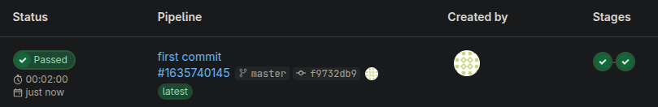
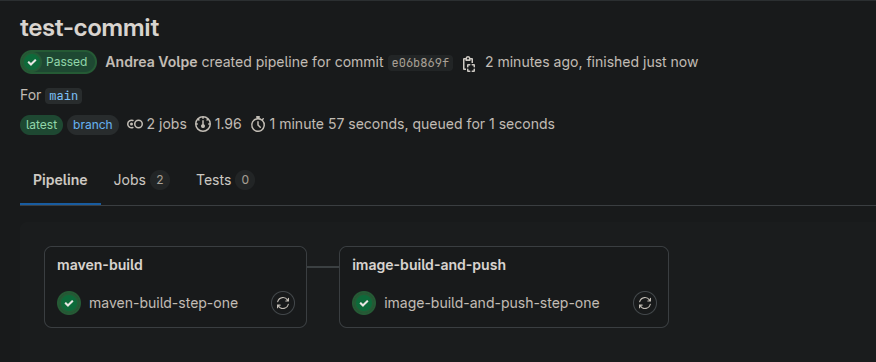

# Verify the GitLab Pipeline

1. open a web browser and access the [gitlab.com](https://gitlab.com/) repository;
2. on the left menù, enter the "Build" > "Pipelines" section:

    

3. you'll see your pipeline as the picture above, starting at each push;
4. click on `Passed` to see a graphical representation of the stages:

   

