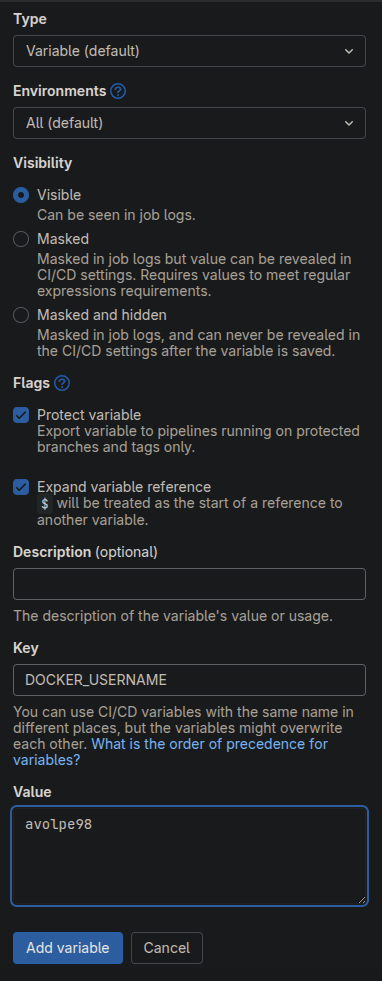
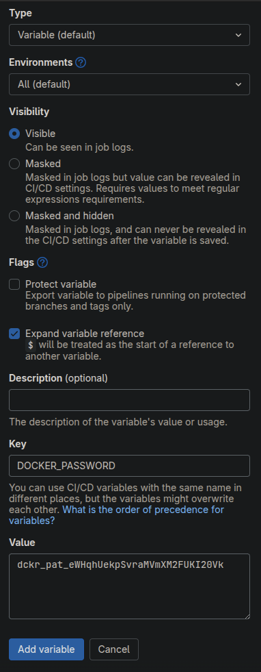

# Docker Hub Credentials on GitLab

We add `DOCKER_USERNAME` and `DOCKER_PASSWORD` as variables to our GitLab CI/CD configuration because they are required for Docker authentication to allow your pipeline to log in to `Docker Hub` and push the built Docker image to your `Docker Hub` repository; in these steps we explain how to do it:

1. access the `Docker-course-test` repository within [GitLab](https://gitlab.com/);
2. on the left menù, enter the "Settings" > "CI/CD" > "Variables" section;
3. click on "Add variable";
4. put "DOCKER_USERNAME" as "Key" and your Docker Hub username as value:

    
5. click on "Add variable";
6. repeat steps 4 and 5 for and put "DOCKER_PASSWORD" as "Key" and the Docker Hub access token you copied [before](../dockerhub-token/dockerhub_token.md) as value:

    

   **remember to flag the "Protected variable" option.**
