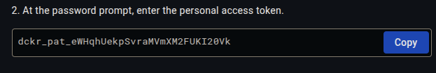

# Docker Hub Token

A Docker Hub access token is used to securely authenticate and authorize automated access to Docker Hub, such as allowing CI/CD pipelines in GitLab to pull or push Docker images without exposing your account password; in these steps we explain how to generate one:

1. access [hub.docker.com](https://hub.docker.com/repositories/);
2. click on your account logo and access the "Account settings";
3. click on "personal access tokens";
4. click on "Generate new token";
5. put "GitLab-test" as project name and "Read & Write" as access permissions, otherwise GitLab will not be able to push the image to Docker Hub:

    
6. **click on "Generate" and copy the access token since it will be only displayed once**:

   
   
   