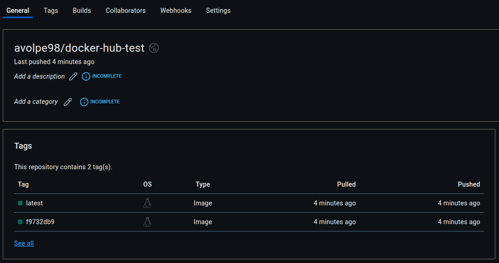

# Verify the Automatic Push on Docker Hub

1. open a web browser and access the [hub.docker.com](https://hub.docker.com/repositories/) repository;
2. within the "General" > "Tags" section, you can see the two tags pushed:

    
3. click on the tags to see more details.