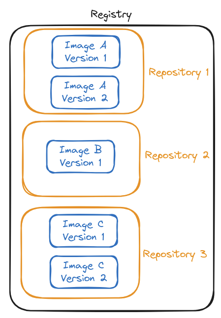

# Registry VS Repository

**Registry:**

- a **registry** is the central service or storage location where Docker images are stored, managed, and distributed;
- it can host multiple repositories, and it serves as a hub for image sharing and distribution.

**Repository:**

- a **repository** is a collection of related Docker images stored in a registry;
- these images represent different versions of the same application or software.

**Comparison:**

- a registry is like a warehouse storing many products (repositories);
- a repository is like a shelf within the warehouse containing multiple versions of a specific product (images).

**Table:**

| Feature        | Registry                         | Repository                    |
|----------------|----------------------------------|-------------------------------|
| **Definition** | central storage for images.      | collection of related images. |
| **Purpose**    | stores and manages repositories. | stores versions of an image.  |
| **Examples**   | Docker Hub, ECR, GCR.            | `nginx`, `redis`, `my-app`.   |
| **Hierarchy**  | contains multiple repositories.  | contains multiple image tags. |

**Image:**

