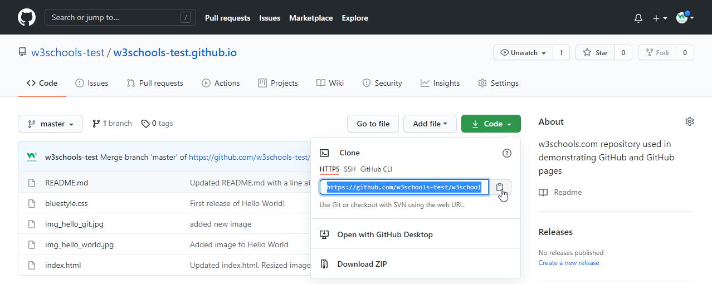

# Initial synchronization with remote repository

The initial synchronization with a remote repository using the `git clone` command is the first step to start collaborating on an existing Git project. 

Here is a brief explanation of the procedure:

1. **Git Clone**

    - The `git clone` command is used to create a local copy of a remote Git repository.
    - The basic syntax is as follows:

```shell
git clone <Remote_repository_URL>
```

Where `<Remote_repository_URL>` is the URL of the Git repository you want to clone. This command creates an identical copy of the remote repository in the specified directory.



You can see in this image where you can normally find the url when using the browser interface.

2. **Synchronization with the Remote repository**

- After cloning the repository, you can start working on your local copy. Synchronizing with the remote repository is essential to get the latest updates and share your own changes. To do this, you can use the following commands:

  - `git fetch`: retrieves the latest changes from the remote repository without applying them to the local copy.

  - `git pull`: retrieves the latest changes from the remote repository and applies them to the local copy.

  - `git push`: sends your changes to the remote repository.

**These commands enable developers to keep their local copy aligned with the remote repository and collaborate effectively on shared projects.**
