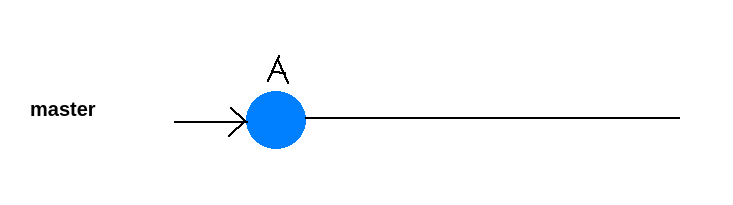
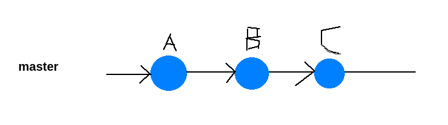
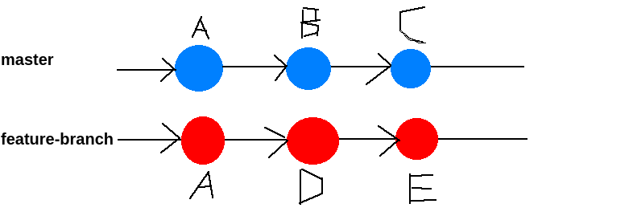
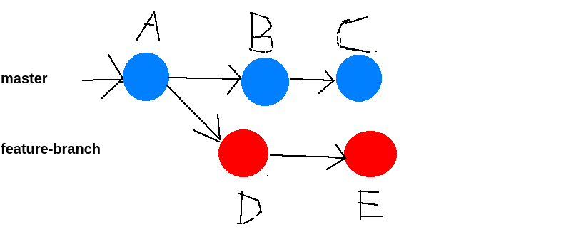
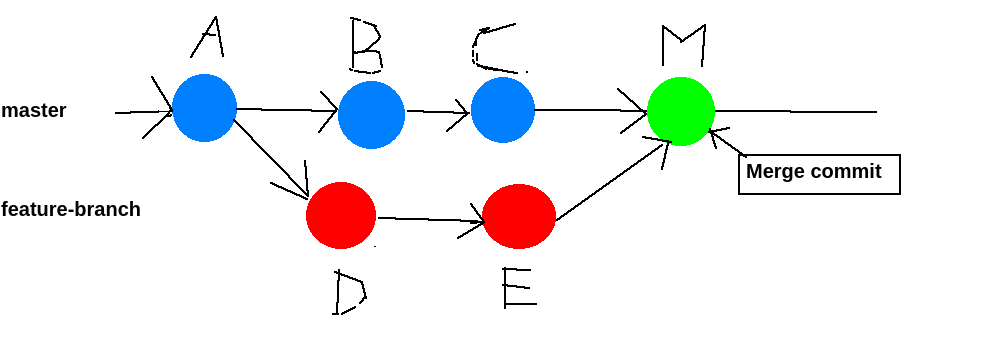

# Can you give an example of merge conflicts by visualizing the commits as nodes of the branches involved?

Let's visualize a common scenario involving two branches with merge conflicts using a simplified diagram. In this example, we have two branches: `main` and `feature-branch`.


1. We have an initial Commit called `A`.




2. Now, let's say both branches have evolved with separate commits:

On the `main` branch:



On the `feature-branch` branch:



In this scenario:

- Commit `B` represents changes made on the `main` branch.
- Commits `D` and `E` represent changes made on the `feature-branch`.
- Commit `C` is also a change on the `main` branch.

Now, let's say you want to merge `feature-branch` into `main`. However, there are conflicting changes between `C` and `E` because both branches modified the same lines of the same file.

When you attempt to merge `feature-branch` into `main`, Git detects the conflict and stops the merge process. The branches now look like this:



To resolve the conflict, you need to manually edit the file that contains conflicting changes (let's call it file.txt). The conflicting portions of file.txt will have conflict markers like this:

```shell
<<<<<<< HEAD
Code from commit C (main branch)
=======
Code from commit E (feature-branch)
>>>>>>> feature-branch
```

You'll need to decide how to combine these changes. After resolving the conflict, your working tree will contain the resolved version of file.txt, which you then stage and commit:



Here, commit M represents the merge commit that combines the changes from feature-branch and main with the conflict resolved. After this, both branches are in sync, and the conflict is resolved.