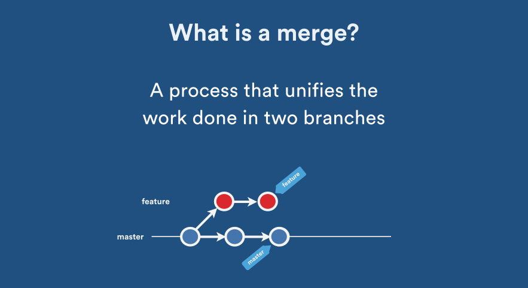

# What are common merge strategies in Git?

Git offers several merge strategies to combine changes from one branch into another. The choice of merge strategy depends on the specific needs of your project and your development workflow. Here are common merge strategies in Git:

1. **Fast-Forward Merge**
   - This is the simplest and default merge strategy.
   - It occurs when the branch being merged into has no new commits since the branch you're merging in.
   - Git simply moves the branch pointer forward to the tip of the other branch, creating a linear history.
     

2. **Recursive Merge (Default Merge)**
   - The default merge strategy used by Git when a fast-forward merge is not possible.
   - Git attempts to combine the changes from both branches, creating a new merge commit.
     

3. **ORT Merge**
   - The ORT (Ostensibly Repeated Three-way) merge strategy is designed to be more efficient and reliable than the default merge strategy.
   - It aims to reduce the likelihood of conflicts and improve the merge process.
   - It's basically the new default strategy. It has been employed by Git since version 2.33.
   