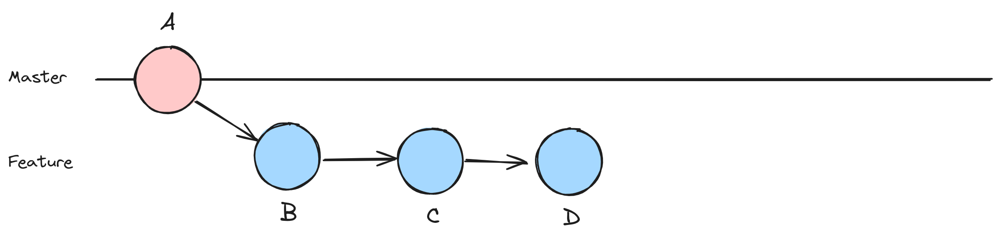
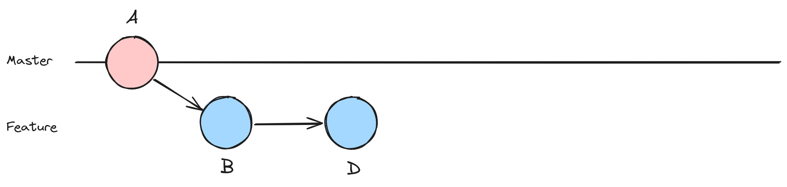

# Drop 

Let's go through an example where we use the interactive rebase option to drop, or remove, a specific commit from the commit history. This can be useful when you want to eliminate unnecessary or incorrect commits. In this example, we'll create a feature branch, make multiple commits, and then use interactive rebase to drop one of the commits.

Using nodes, it might look something like this:





1. **Create a new repository, if you don't have one ready for this exercise**

```shell
# Create a new directory for the repository
mkdir rebase-example

# Change into the repository directory
cd rebase-example

# Initialize a new Git repository
git init
```

2. **Create a simple file on your target branch**

```shell
# Create a new file and add some content
echo "Hello, World!" > hello.txt

# Add and commit the file
git add hello.txt
git commit -m "Initial commit"
```

3. **Create a feature branch and make commits**

```shell
# Create and switch to a new feature branch
git checkout -b feature-branch

# Make some changes and commit multiple times
echo "Feature branch content - Part 1" >> hello.txt
git add hello.txt
git commit -m "Feature branch: Commit 1"

echo "Feature branch content - Part 2" >> hello.txt
git add hello.txt
git commit -m "Feature branch: Commit 2"

echo "Feature branch content - Part 3" >> hello.txt
git add hello.txt
git commit -m "Feature branch: Commit 3"
```

4. **Drop a commit using interactive rebase**

```shell
# Start an interactive rebase to drop a commit
git rebase -i HEAD~3
```

An editor will open with a list of commits. Change the word "pick" to "drop" for the commit you want to remove. Save and close the editor.

## Dropping intermediate commits

If you try to drop intermediate commits during an interactive rebase and encounter errors, Git will typically inform you about the need to resolve conflicts or indicate any issues that may arise during the rebase process. However, the specific error message can vary depending on the situation. 
