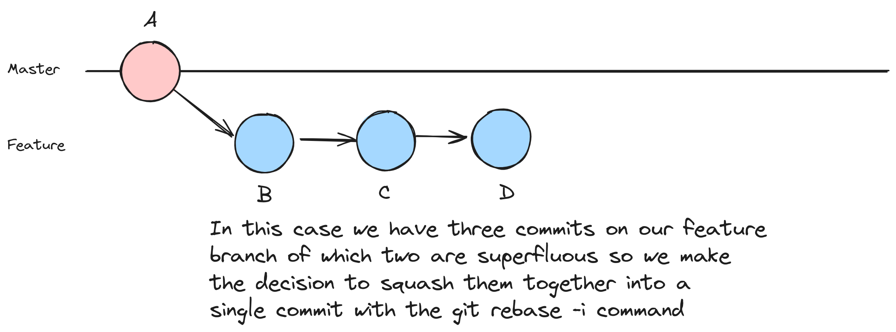
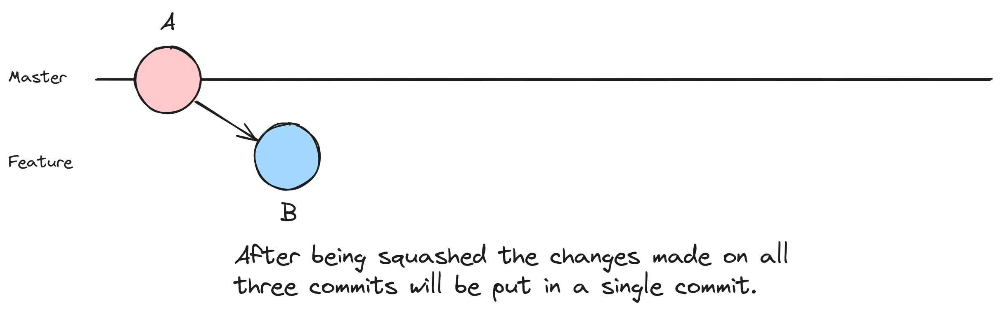

# Squash

Let's go through an example where we use the interactive rebase option to squash multiple commits into a single commit. This can be useful to maintain a clean and concise commit history. In this example, we'll create a feature branch with multiple commits and then squash them during an interactive rebase before merging into the master branch.

`NOTE: squashing them you will have to choose a commit message.`

Using nodes, it might look something like this:





1. **Create a new repository, if you don't have one ready for this exercise**

```shell
# Create a new directory for the repository
mkdir rebase-example

# Change into the repository directory
cd rebase-example

# Initialize a new Git repository
git init
```

2. **Create a simple file on your target branch**

```shell
# Create a new file and add some content
echo "Hello, World!" > hello.txt

# Add and commit the file
git add hello.txt
git commit -m "Initial commit"
```

3. **Create a feature branch and make commits**

```shell
# Create and switch to a new feature branch
git checkout -b feature-branch

# Make some changes and commit multiple times
echo "Feature branch content - Part 1" >> hello.txt
git add hello.txt
git commit -m "Feature branch: Commit 1"

echo "Feature branch content - Part 2" >> hello.txt
git add hello.txt
git commit -m "Feature branch: Commit 2"

echo "Feature branch content - Part 3" >> hello.txt
git add hello.txt
git commit -m "Feature branch: Commit 3"
```

4. **Squash commits using interactive rebase**

```shell
# Start an interactive rebase to squash commits
git rebase -i HEAD~3
```

5. **Edit the squashed commit message**

Git will open another editor for you to edit the commit message. Keep only the commit message you want for the squashed commit. Save and close the editor.

