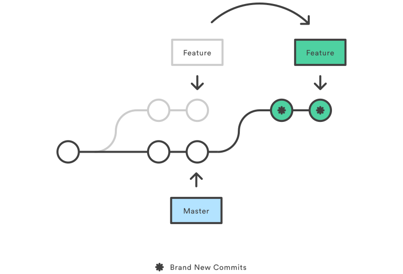

# Fundamentals of rebase

Git rebase is a powerful but potentially complex operation in Git that allows you to modify the commit history of a branch. The basic idea behind rebase is to take a series of commits and apply them onto a different base commit. This can be particularly useful for cleaning up and streamlining commit history, making it more linear and easier to understand.

**The process to perform a rebase**

1. **Identify Commits**: the commits in the branch to be rebased are identified.
2. **Move to New Base**: these commits are then moved or replayed onto a new base commit.
3. **Linear History**: the result is a linear sequence of commits, with the rebased commits following the new base commit.

**Key Points**

- Rebasing provides a cleaner and more linear history, making it easier to understand the project's evolution.
- It helps in avoiding unnecessary merge commits and simplifies the branching structure.
