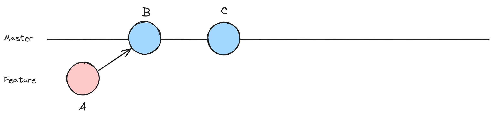
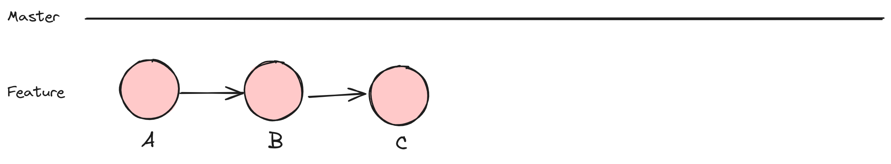

# Case 1 (fast-forward)

Let's go through an example where changes are made only on the feature branch, and we want to rebase that branch onto the master branch without introducing an extra commit on master.

Using nodes, it might look something like this:





1. **Create a new repository, if you don't have one ready for this exercise**

```shell
# Create a new directory for the repository
mkdir rebase-example

# Change into the repository directory
cd rebase-example

# Initialize a new Git repository
git init
```

2. **Create a simple file on your target branch**

```shell
# Create a new file and add some content
echo "Hello, World!" > hello.txt

# Add and commit the file
git add hello.txt
git commit -m "Initial commit"
```

3. **Create a feature branch and make changes**

```shell
# Create and switch to a new feature branch
git checkout -b feature-branch

# Make some changes in the feature branch
echo "Additional content in feature-branch" >> hello.txt

# Add and commit the changes in the feature branch
git add hello.txt
git commit -m "feature-branch changes"
```

4. **Switch to the master branch(target) to check no changes where made and make no changes**

```shell
# Switch back to the master branch
git checkout master
```

5. **Rebase the feature branch onto master**

```shell
# Switch back to the feature branch
git checkout feature-branch

# Rebase the feature branch onto the master branch
git rebase master
```

Since there were no changes on the `master` branch after the `feature-branch` was created, the rebase will be fast-forwarded, and no extra commit will be created on the master branch.

## Result

In this scenario, the changes made in the `feature-branch` are reapplied on top of the `master` branch, and no extra commit is introduced on the master branch. The commit history remains linear, and the feature branch changes appear as part of the master branch history.

```shell
# After the rebase, check the commit history
git log --oneline
```

The commit history should show a linear sequence of commits without an additional commit for the rebase.

