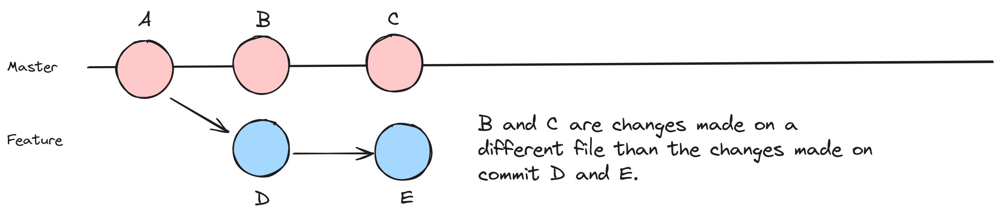
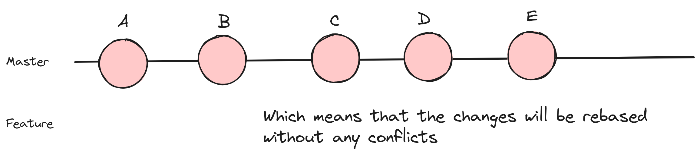

# Case 2 (no fast-forward, no-conflicts)

Let's go through an example where there are no conflicts during a rebase. We'll create a scenario where a feature branch is created, changes are made in both the feature and master branches, and then we'll rebase the feature branch onto master.

Using nodes, it might look something like this:





1. **Create a new repository, if you don't have one ready for this exercise**

```shell
# Create a new directory for the repository
mkdir rebase-example

# Change into the repository directory
cd rebase-example

# Initialize a new Git repository
git init
```

2. **Create a simple file on your target branch**

```shell
# Create a new file and add some content
echo "Hello, World!" > hello.txt

# Add and commit the file
git add hello.txt
git commit -m "Initial commit"
```

3. **Create a feature branch and make changes**

```shell
# Create and switch to a new feature branch
git checkout -b feature-branch

# Make some changes in the feature branch
echo "Additional content in feature-branch" >> hello.txt

# Add and commit the changes in the feature branch
git add hello.txt
git commit -m "feature-branch changes"
```

4. **Switch to the master branch and make changes on a different line or file**

```shell
# Switch back to the master branch
git checkout master

# Make some changes in the master branch on a 
# different line of the same file or on a different 
# file altogether

# Add and commit the changes in the master branch
git add hello.txt
git commit -m "master branch changes"
```

5. **Rebase the feature branch onto master**

```shell
# Switch back to the feature branch
git checkout feature-branch

# Rebase the feature branch onto the master branch
git rebase master
```